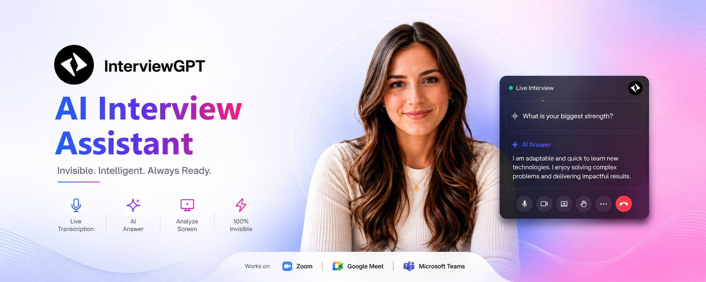

<div align="center">

<a href="https://www.interviewgpt.in">
  
</a>

# InterviewGPT Desktop

**The AI interview assistant for Windows: real-time answers for interviews, meetings and sales calls, invisible on screen share.**

[](https://github.com/rahul-devbox/interviewgpt-desktop/releases/latest)
[](https://www.interviewgpt.in/download)
[](https://github.com/rahul-devbox/interviewgpt-desktop/releases/latest)
[](https://www.interviewgpt.in)

[**Download for Windows**](https://www.interviewgpt.in/download) · [All releases](https://github.com/rahul-devbox/interviewgpt-desktop/releases) · [Website](https://www.interviewgpt.in) · [Pricing](https://www.interviewgpt.in/pricing) · [Report a bug](https://github.com/rahul-devbox/interviewgpt-desktop/issues)

</div>

---

## What is InterviewGPT?

InterviewGPT is an AI interview assistant for Windows that gives real-time answers in interviews, meetings and sales calls, and stays invisible on screen share. It listens to both sides of the call, transcribes it, and suggests an answer based on your resume and the role while the conversation is still going.

This repository is the **official home of the desktop app's public releases**: installers, release notes, checksums and update files. The app's source code is private and is never published here. The desktop app installs under the name **SysCore**.

## Features

| | Feature | What it does |
|---|---|---|
| 🎙️ | **Live transcription** | Both sides of the call as text, in real time, with or without headphones |
| ✨ | **AI Answer** | Answer suggestions written from your resume, the role and your instructions |
| 🖥️ | **Analyze Screen** | Reads a coding problem, diagram or slide on your screen and answers it |
| 💬 | **Chat with AI** | Ask follow-up questions and attach screenshots |
| 🎛️ | **Answer styles** | Full answer, answer + key points, or key points only; natural, confident or formal tone |
| 🫥 | **Invisible on screen share** | Windows keeps the app out of screen share, recordings and screenshots on supported setups |
| 📱 | **Phone companion** | See answers on your phone during a desktop session |
| 🌐 | **Free Invisible Browser** | ChatGPT, Claude and Gemini in a window that screen share can't see |
| 🗂️ | **Session history** | Transcripts of past sessions, saved to your account |

Works with **Zoom, Google Meet, Microsoft Teams, Webex, Slack, Discord** and other call apps: it works at the system level, so the meeting app doesn't matter.

## Download

| Platform | Status | Recommended | Alternative |
|---|---|---|---|
| **Windows 10 / 11 (64-bit)** | ✅ Stable | `SysCore-Setup-<version>.exe` (installer, updates automatically) | `SysCore-Portable-<version>.exe` (no install, good for restricted PCs) |
| **macOS (Intel and Apple silicon)** | 🧪 **Beta** | `SysCore-<version>-mac-universal.dmg` | `SysCore-<version>-mac-universal.zip` |

👉 **Easiest:** download from [interviewgpt.in/download](https://www.interviewgpt.in/download), which always gives you the latest Windows version.
👉 **All files and older versions:** [GitHub Releases](https://github.com/rahul-devbox/interviewgpt-desktop/releases).

## Install on Windows

1. Download `SysCore-Setup-<version>.exe` from the [download page](https://www.interviewgpt.in/download) or the [latest release](https://github.com/rahul-devbox/interviewgpt-desktop/releases/latest).
2. Run the file.
3. **Windows may show a blue "Windows protected your PC" warning.** The app is signed with our own (self-signed) certificate, which Windows SmartScreen doesn't recognise yet. Click **More info → Run anyway** to continue.
4. Follow the installer, then open **SysCore** and sign in with your InterviewGPT account.

Prefer no installation? Download `SysCore-Portable-<version>.exe` and run it directly (you'll see the same warning; click **More info → Run anyway**).

> Want to be sure the file is genuine? Compare it with `checksums.sha256` from the same release (see [Verify a download](#verify-a-download)).

## Install on macOS (beta)

The Mac version is in **beta**: it works, but it gets less testing than Windows and is **not signed by Apple yet**, so macOS will warn you the first time.

1. Download the `.dmg` from the [latest release](https://github.com/rahul-devbox/interviewgpt-desktop/releases/latest).
2. Open it and drag **SysCore** into **Applications**.
3. Open SysCore. When macOS says it can't verify the app, click **Done**.
4. Go to **System Settings → Privacy & Security**, scroll down, and click **Open Anyway** next to SysCore. Confirm with your password.
5. Allow the microphone and screen-recording permissions the app asks for.

If macOS says the app **"is damaged and can't be opened"**, run this once in Terminal, then open it again:

```bash
xattr -cr /Applications/SysCore.app
```

Found a Mac issue? Please [open an issue](https://github.com/rahul-devbox/interviewgpt-desktop/issues) with your macOS version.

## Get started

1. **Sign in** with your InterviewGPT account (free to create).
2. **Add your resume** and the role, and pick an answer style.
3. **Start a session** before you join the call. Run a private test call first to check audio and screen share.
4. During the call, use **AI Answer**, **Analyze Screen** or **Chat**.
5. **End the session** to save the transcript to your history.

### Useful shortcuts (Windows)

| Shortcut | Action |
|---|---|
| `Ctrl + Alt + H` | Hide or show the whole app |
| `Ctrl + Shift + Enter` | Analyze Screen |
| `Ctrl + Shift + A` | Open AI chat |

Full list: [interviewgpt.in/shortcuts](https://www.interviewgpt.in/shortcuts).

## Updates

- **Installer:** updates download in the background and install the next time you restart the app.
- **Portable:** the new version downloads in the background; close the app and run the new file.

## Pricing

- **Free:** 10-minute sessions, up to 3 a day, no card needed.
- **Credits:** pay as you go; 1 credit = 1 hour, used in 30-minute blocks. **Credits never expire.**
- **Unlimited passes:** weekly, monthly or yearly.

Current prices: [interviewgpt.in/pricing](https://www.interviewgpt.in/pricing).

## Privacy and security

- Audio is streamed for transcription and **not stored** by InterviewGPT.
- This repository contains **only** release files and documentation: never source code, credentials or user data.
- Every release includes SHA-256 checksums, a CycloneDX SBOM, a release manifest and GitHub artifact attestations.

More: [interviewgpt.in/privacy](https://www.interviewgpt.in/privacy) · [interviewgpt.in/trust](https://www.interviewgpt.in/trust)

## Verify a download

Download `checksums.sha256` from the same release as your file.

**Windows (PowerShell):**

```powershell
Get-FileHash .\SysCore-Setup-<version>.exe -Algorithm SHA256
Get-Content .\checksums.sha256
```

**macOS:**

```bash
shasum -a 256 SysCore-<version>-mac-universal.dmg
grep 'mac-universal.dmg' checksums.sha256
```

**GitHub CLI (artifact attestation):**

```bash
gh attestation verify SysCore-Setup-<version>.exe --repo rahul-devbox/interviewgpt-desktop
```

## FAQ

<details>
<summary><b>Why does Windows say "Windows protected your PC"?</b></summary>

SmartScreen shows this for apps it hasn't seen often yet. InterviewGPT is signed with our own self-signed certificate. Click **More info → Run anyway**. You can check the file against `checksums.sha256` first.
</details>

<details>
<summary><b>Can the other people on the call see InterviewGPT?</b></summary>

On supported Windows 10/11 setups, Windows itself excludes the app's window from screen share, recordings and screenshots, so they see the desktop behind it. Always run a private test call first.
</details>

<details>
<summary><b>Is the Mac version ready?</b></summary>

It's a beta: the main features work, but Windows is our primary platform. Expect the first-launch warning described in [Install on macOS](#install-on-macos-beta).
</details>

<details>
<summary><b>Is it free?</b></summary>

Yes, you can start free: 10-minute sessions, up to 3 a day. The Invisible Browser and the ATS resume checker are free too.
</details>

## Support

- 🌐 Website: [www.interviewgpt.in](https://www.interviewgpt.in)
- 🐞 Bugs: [GitHub Issues](https://github.com/rahul-devbox/interviewgpt-desktop/issues) (include your OS, app version and install type; never post passwords, resumes or transcripts)
- ✉️ Email: [support@interviewgpt.in](mailto:support@interviewgpt.in)
- ▶️ YouTube: [@Interview-gpt](https://www.youtube.com/@Interview-gpt)

## Responsible use

InterviewGPT is built for conversations where AI assistance is permitted. Follow the rules of your employer, interviewer and meeting platform, and get consent for recording or transcription where required.

## For maintainers

Release process and configuration: [docs/RELEASING.md](./docs/RELEASING.md) · [docs/dual-repo-release-process.md](./docs/dual-repo-release-process.md) · [docs/github-configuration.md](./docs/github-configuration.md)

---

<div align="center">

**InterviewGPT · Invisible. Intelligent. Always ready.**
[www.interviewgpt.in](https://www.interviewgpt.in)

</div>
