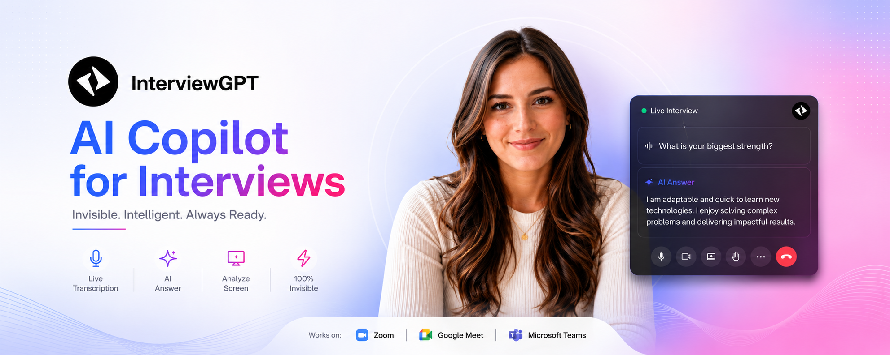

<div align="center">
  <a href="https://www.interviewgpt.in">
    
  </a>

  <h1>InterviewGPT Desktop</h1>

  <p><strong>Your AI copilot for interviews—live transcription, personalized answers, and screen analysis in one desktop app.</strong></p>

  <p>
    <a href="https://www.interviewgpt.in/download"><strong>Download from the website</strong></a>
    ·
    <a href="https://github.com/rahul-devbox/interviewgpt-desktop/releases/latest"><strong>Download the latest GitHub release</strong></a>
    ·
    <a href="https://www.interviewgpt.in"><strong>Visit InterviewGPT</strong></a>
  </p>

  <p>
    <a href="https://github.com/rahul-devbox/interviewgpt-desktop/releases/latest">
      
    </a>
    <a href="https://github.com/rahul-devbox/interviewgpt-desktop/actions/workflows/release-from-private.yml">
      
    </a>
    <a href="https://www.interviewgpt.in">
      
    </a>
    
  </p>
</div>

## AI interview assistance on your desktop

InterviewGPT is an AI interview copilot and desktop interview assistant for Windows and macOS. It works alongside meeting and assessment platforms to provide real-time transcription, context-aware AI answers, and visual analysis while you stay focused on the conversation.

The packaged desktop application is distributed as **SysCore**. This public repository is the official home for InterviewGPT desktop downloads, release notes, checksums, software bills of materials (SBOMs), and update metadata. The private application source code and service credentials are never published here.

## Features

- **Live transcription** — follow interview questions in real time with noise-reduced speech recognition.
- **Personalized AI answers** — receive concise suggestions informed by your resume, target role, and instructions.
- **Screen analysis** — analyze coding problems, diagrams, slides, and other on-screen context.
- **Technical interview support** — work through coding, data structures, algorithms, and system-design questions.
- **Broad platform compatibility** — use InterviewGPT alongside Zoom, Google Meet, Microsoft Teams, coding platforms, and other interview tools.
- **Discreet desktop workflow** — keep assistance available without interrupting the interview experience.
- **Session history** — review transcripts and previous sessions after the interview.
- **Windows and macOS releases** — choose an installer or portable package for your platform.

Learn more about the product at [interviewgpt.in](https://www.interviewgpt.in).

## Download InterviewGPT

You can download InterviewGPT from either official location:

1. **Website:** [interviewgpt.in/download](https://www.interviewgpt.in/download)
2. **GitHub:** [Latest InterviewGPT desktop release](https://github.com/rahul-devbox/interviewgpt-desktop/releases/latest)

| Platform        | Recommended download                  | Alternative                           |
| --------------- | ------------------------------------- | ------------------------------------- |
| Windows 64-bit  | `SysCore-Setup-<version>.exe`         | `SysCore-Portable-<version>.exe`      |
| macOS Universal | `SysCore-<version>-mac-universal.dmg` | `SysCore-<version>-mac-universal.zip` |

Every GitHub release also contains updater metadata, SHA-256 checksums, a CycloneDX SBOM, and a release manifest that identifies the exact approved source revision.

## Installation

### Windows

1. Open the [InterviewGPT download page](https://www.interviewgpt.in/download) or [GitHub Releases](https://github.com/rahul-devbox/interviewgpt-desktop/releases/latest).
2. Download `SysCore-Setup-<version>.exe` for the guided installer.
3. Run the installer and follow the prompts.
4. Alternatively, download `SysCore-Portable-<version>.exe` if you prefer a portable build.
5. Launch SysCore and sign in to your InterviewGPT account.

Windows release artifacts are signed and verified by the release workflow before publication. You can additionally compare the file against `checksums.sha256` from the same release.

### macOS

1. Open [GitHub Releases](https://github.com/rahul-devbox/interviewgpt-desktop/releases/latest).
2. Download the universal DMG or ZIP package.
3. Open the DMG and move SysCore to Applications, or extract the ZIP.
4. Launch SysCore and grant the permissions required for the features you intend to use.

The universal build supports Intel and Apple silicon Macs. Check the individual release notes for the macOS signing and notarization status before installing.

## How to use InterviewGPT

1. **Sign in** with your InterviewGPT account.
2. **Add context** such as your resume, target role, and preferred answer style.
3. **Start a session** before joining your interview or practice call.
4. Use **live transcription**, **AI Answer**, or **Analyze Screen** when relevant.
5. End the session to save and review the transcript in your history.

For the best results, test your microphone, system-audio permissions, shortcuts, and screen-capture permissions before an important interview.

## Releases and release notes

- [Latest release](https://github.com/rahul-devbox/interviewgpt-desktop/releases/latest)
- [All releases and release notes](https://github.com/rahul-devbox/interviewgpt-desktop/releases)
- [Official website](https://www.interviewgpt.in)

Each release is built from an exact approved private-source commit. The automated pipeline validates dependencies, runs linting and type checks, executes the test suite, builds Windows and macOS artifacts, generates checksums and an SBOM, and publishes a release manifest for traceability.

## Verify a download

Download `checksums.sha256` from the same release as your application file.

Windows PowerShell:

```powershell
Get-FileHash .\SysCore-Setup-<version>.exe -Algorithm SHA256
Get-Content .\checksums.sha256
```

macOS:

```bash
shasum -a 256 SysCore-<version>-mac-universal.dmg
grep 'SysCore-<version>-mac-universal.dmg' checksums.sha256
```

GitHub CLI users can also verify the release attestation:

```bash
gh attestation verify SysCore-Setup-<version>.exe \
  --repo rahul-devbox/interviewgpt-desktop
```

## Security and repository scope

This repository intentionally contains release automation, documentation, downloadable binaries, and public verification metadata only. It must never contain private Electron source code, backend credentials, authentication secrets, payment secrets, or signing keys.

Published releases can include:

- Windows installer and portable executables
- macOS DMG and ZIP packages
- `latest.yml`, `latest-mac.yml`, and `portable-win.json`
- `checksums.sha256`
- `sbom.cyclonedx.json`
- `release-manifest.json`
- GitHub artifact attestations

For release-process details, see [Releasing InterviewGPT Desktop](./docs/RELEASING.md) and the [dual-repository release architecture](./docs/dual-repo-release-process.md).

## Support and feedback

- Product information and downloads: [https://www.interviewgpt.in](https://www.interviewgpt.in)
- Desktop downloads: [GitHub Releases](https://github.com/rahul-devbox/interviewgpt-desktop/releases)
- Bug reports: [GitHub Issues](https://github.com/rahul-devbox/interviewgpt-desktop/issues)

When reporting a desktop issue, include your operating system, SysCore version, installation type, and the relevant non-sensitive logs. Never post access tokens, credentials, resumes, interview transcripts, or other personal data publicly.

## Responsible use

Use InterviewGPT in accordance with applicable interview, employer, platform, and local policies. Obtain consent for recording or transcription wherever required.

---

<div align="center">
  <strong>InterviewGPT — Invisible. Intelligent. Always Ready.</strong><br />
  <a href="https://www.interviewgpt.in">www.interviewgpt.in</a>
</div>
